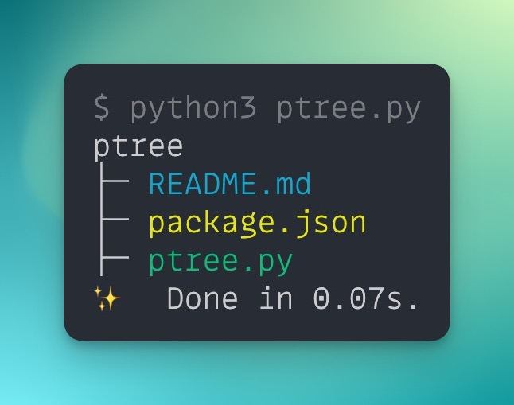

# Pretty Tree

aka `ptree` is a simple Python script that displays the directory tree of the current working directory with color-coded output for easy file identification.

<div style="text-align:center;">
  
</div>


<div align="center">

[](https://github.com/itsbrex/ptree/actions/workflows/ci.yml) 
# TODO: 

[](https://www.npmjs.com/package/ptree) [](https://www.npmjs.com/package/ptree) [](https://github.com/itsbrex/ptree/blob/main/LICENSE)

</div>

## Installation  
To install `ptree` globally, use your preferred package manager like `pnpm`, `yarn`, `npm`, or `bun`.
```bash
pnpm i -g ptree
```
## Usage  
Navigate to any folder and run `ptree`. The script will recursively pretty print the directory structure.
>By default, `ptree` excludes certain folders and file patterns like `node_modules` and `.git` to make the output more manageable.  

If installed globally, you can just run `ptree` in any directory:
```bash
ptree
```

Or via `npx`:
```bash
npx ptree
```


## Customization
- To add more file types and colors to the output, you can modify the `FILE_TYPE_COLORS` dictionary in the script.
- You can also customize the excluded file patterns by modifying the `EXCLUDED_PATTERNS` list in the script.

## Contributing 

If you find any bugs or want to suggest new features for `ptree`, please feel free to contribute by submitting an issue or pull request.

Contributions are welcomed! This project follows the all-contributors spec. ([emoji key](https://github.com/all-contributors/all-contributors#emoji-key)):

<!-- ALL-CONTRIBUTORS-BADGE:START - Do not remove or modify this section -->
[](#Contributing)

<!-- ALL-CONTRIBUTORS-BADGE:END -->

<!-- ALL-CONTRIBUTORS-LIST:START - Do not remove or modify this section -->
<!-- prettier-ignore-start -->
<!-- markdownlint-disable -->

<!-- markdownlint-restore -->
<!-- prettier-ignore-end -->

<!-- ALL-CONTRIBUTORS-LIST:END -->


## License

Licensed under the MIT license. See the [LICENSE](./LICENSE) file for more information.

If you found this project interesting, please consider [sponsoring me](https://github.com/sponsors/itsbrex) or <a href="https://twitter.com/itsbrex">following me on twitter </a>